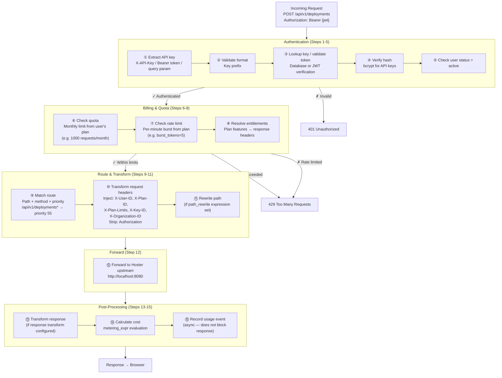
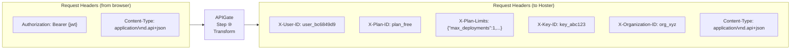

# APIGate Billing Pipeline — Detail

Source: `specs/architecture/apigate-integration.md`, [APIGate Wiki](https://github.com/artpar/apigate/wiki)

This pipeline runs **only** for routes with `auth_required=1` (currently just `/api/v1/deployments*`).
Pass-through routes (`auth_required=0`) skip this entirely.

## Full 15-Step Pipeline

## Header Injection Detail (Step 10)

APIGate **strips** the Authorization header and **injects** identity headers that Hoster trusts.

## What Pass-Through Routes Skip

| Step | Description | Billing Route | Pass-Through |
|------|-------------|:---:|:---:|
| 1-5 | Authentication | Yes | **Skipped** |
| 6 | Quota check | Yes | **Skipped** |
| 7 | Rate limit | Yes | **Skipped** |
| 8 | Entitlements | Yes | **Skipped** |
| 9 | Route match | Yes | Yes |
| 10 | Header transform | Yes | **No** (headers forwarded as-is) |
| 11 | Path rewrite | Yes | **No** |
| 12 | Forward to upstream | Yes | Yes |
| 13-15 | Post-processing | Yes | **Skipped** |

## Why This Matters

Monitoring endpoints (`/api/v1/deployments/{id}/monitoring/*`) poll at ~50 requests/min. If they went through the billing pipeline, a free-tier user (1000 req/month, burst=5) would exhaust quota in 20 minutes. By using pass-through routes for non-billing APIs, monitoring works without hitting limits.

**Current trade-off:** The APIGate route pattern `/api/v1/deployments*` matches monitoring sub-routes too, so they currently go through the billing lane. A more granular APIGate route configuration could separate these, but the current setup works because APIGate doesn't reject pass-through requests that happen to match a billing route pattern — the billing behavior is applied per the `auth_required` flag on the matched route.
