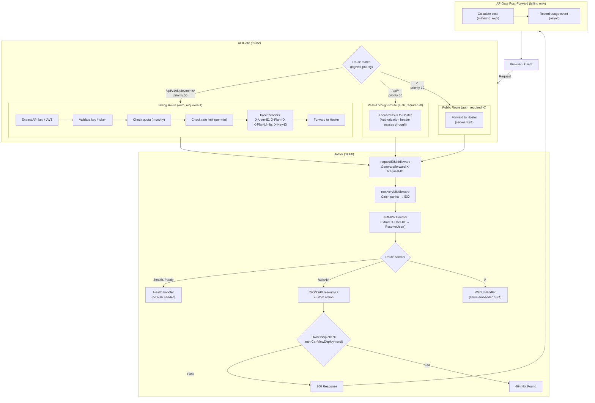

# Request Flow — Full Lifecycle

Source: `internal/shell/api/setup.go`, `specs/architecture/apigate-integration.md`

## Three Request Lanes

## Lane Summary

| Lane | APIGate Route | auth_required | What APIGate Does | What Hoster Does |
|------|--------------|---------------|-------------------|------------------|
| **Billing** | `/api/v1/deployments*` (priority 55) | 1 | JWT validate, quota, rate-limit, meter, inject headers | Auth middleware resolves user, handler checks ownership |
| **Pass-through** | `/api/*` (priority 50) | 0 | Forward as-is | Auth middleware resolves user from headers, handler checks ownership |
| **Public** | `/*` (priority 10) | 0 | Forward as-is | Serve embedded SPA (no auth needed) |

## Key Points

- APIGate evaluates routes by **priority** (highest first) — deployment routes (55) match before general API (50)
- Hoster **always** runs auth middleware — even for public routes (it just sets `Authenticated: false`)
- Ownership checks happen **in the handler**, not the middleware — middleware only extracts identity
- Health endpoints (`/health`, `/ready`) bypass auth entirely — they respond before the auth middleware matters
