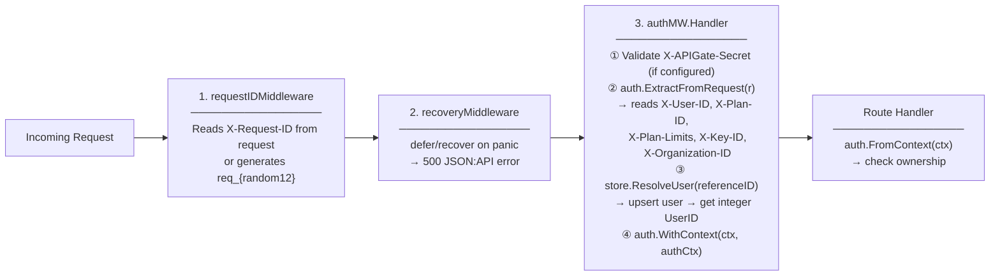

# Route & Auth Map — Every Endpoint

Source: `internal/shell/api/setup.go` (lines 56-259), `internal/shell/api/monitoring_handlers.go`, `internal/shell/api/domain_handlers.go`

## Route Table

### Public (no auth required)

| Route | Method | Handler | Notes |
|-------|--------|---------|-------|
| `/health` | GET | `healthHandler` | Simple JSON `{"status":"healthy"}` |
| `/ready` | GET | `readyHandler` | Readiness with DB check |
| `/*` | GET | `WebUIHandler` | Embedded SPA (catch-all, lowest priority) |
| `/openapi.json` | GET | `openapiGen.Handler` | OpenAPI 3.0 spec |

### Authenticated + Billable (APIGate auth_required=1, route: `/api/v1/deployments*`)

These routes go through APIGate's billing pipeline (quota + rate-limit + metering).

| Route | Method | Handler | Ownership Check |
|-------|--------|---------|-----------------|
| `/api/v1/deployments` | GET | `api2go` FindAll | Filters by `user_id` |
| `/api/v1/deployments` | POST | `api2go` Create | Sets `user_id` from auth |
| `/api/v1/deployments/{id}` | GET | `api2go` FindOne | `CanViewDeployment()` |
| `/api/v1/deployments/{id}` | DELETE | `api2go` Delete | `CanViewDeployment()` |
| `/api/v1/deployments/{id}/start` | POST | `deploymentResource.StartDeployment` | In handler |
| `/api/v1/deployments/{id}/stop` | POST | `deploymentResource.StopDeployment` | In handler |
| `/api/v1/deployments/{id}/domains` | GET | `domainHandlers.ListDomains` | `CanViewDeployment()` |
| `/api/v1/deployments/{id}/domains` | POST | `domainHandlers.AddDomain` | `CanViewDeployment()` |
| `/api/v1/deployments/{id}/domains/{hostname}` | DELETE | `domainHandlers.RemoveDomain` | `CanViewDeployment()` |
| `/api/v1/deployments/{id}/domains/{hostname}/verify` | POST | `domainHandlers.VerifyDomain` | `CanViewDeployment()` |
| `/api/v1/deployments/{id}/monitoring/health` | GET | `monitoringHandlers.HealthHandler` | `CanViewDeployment()` |
| `/api/v1/deployments/{id}/monitoring/logs` | GET | `monitoringHandlers.LogsHandler` | `CanViewDeployment()` |
| `/api/v1/deployments/{id}/monitoring/stats` | GET | `monitoringHandlers.StatsHandler` | `CanViewDeployment()` |
| `/api/v1/deployments/{id}/monitoring/events` | GET | `monitoringHandlers.EventsHandler` | `CanViewDeployment()` |

> **Note:** Monitoring and domain sub-routes match `/api/v1/deployments*` in APIGate, so they go through the billing lane. This is a known trade-off — the alternative would require more granular APIGate routes.

### Authenticated + Pass-through (APIGate auth_required=0, route: `/api/*`)

These routes bypass APIGate billing — forwarded as-is. Hoster auth middleware extracts identity.

| Route | Method | Handler | Ownership Check |
|-------|--------|---------|-----------------|
| `/api/v1/templates` | GET | `api2go` FindAll | Public (all templates visible) |
| `/api/v1/templates` | POST | `api2go` Create | Admin only |
| `/api/v1/templates/{id}` | GET | `api2go` FindOne | Public |
| `/api/v1/templates/{id}` | PUT | `api2go` Update | Admin only |
| `/api/v1/templates/{id}` | DELETE | `api2go` Delete | Admin only |
| `/api/v1/templates/{id}/publish` | POST | `templateResource.PublishTemplate` | Admin only |
| `/api/v1/nodes` | GET | `api2go` FindAll | Filters by `user_id` |
| `/api/v1/nodes` | POST | `api2go` Create | Sets `user_id` from auth |
| `/api/v1/nodes/{id}` | GET | `api2go` FindOne | Owner only |
| `/api/v1/nodes/{id}` | PUT | `api2go` Update | Owner only |
| `/api/v1/nodes/{id}` | DELETE | `api2go` Delete | Owner only |
| `/api/v1/nodes/{id}/maintenance` | POST | `nodeResource.SetMaintenance(true)` | Owner only |
| `/api/v1/nodes/{id}/maintenance` | DELETE | `nodeResource.SetMaintenance(false)` | Owner only |
| `/api/v1/ssh_keys` | GET | `api2go` FindAll | Filters by `user_id` |
| `/api/v1/ssh_keys` | POST | `api2go` Create | Sets `user_id` from auth |
| `/api/v1/ssh_keys/{id}` | GET | `api2go` FindOne | Owner only |
| `/api/v1/ssh_keys/{id}` | DELETE | `api2go` Delete | Owner only |
| `/api/v1/cloud_credentials` | GET | `api2go` FindAll | Filters by `user_id` |
| `/api/v1/cloud_credentials` | POST | `api2go` Create | Sets `user_id` from auth |
| `/api/v1/cloud_credentials/{id}` | GET | `api2go` FindOne | Owner only |
| `/api/v1/cloud_credentials/{id}` | DELETE | `api2go` Delete | Owner only |
| `/api/v1/cloud_credentials/{id}/regions` | GET | `cloudCredentialResource.ListRegions` | Owner only |
| `/api/v1/cloud_credentials/{id}/sizes` | GET | `cloudCredentialResource.ListSizes` | Owner only |
| `/api/v1/cloud_provisions` | GET | `api2go` FindAll | Filters by `user_id` |
| `/api/v1/cloud_provisions` | POST | `api2go` Create | Sets `user_id` from auth |
| `/api/v1/cloud_provisions/{id}` | GET | `api2go` FindOne | Owner only |
| `/api/v1/cloud_provisions/{id}` | DELETE | `api2go` Delete | Owner only |
| `/api/v1/cloud_provisions/{id}/retry` | POST | `cloudProvisionResource.RetryProvision` | Owner only |

## Middleware Chain

## Auth Context Fields

Extracted by `auth.ExtractFromHeaders()` in `internal/core/auth/context.go`:

| Header | Context Field | Source |
|--------|--------------|--------|
| `X-User-ID` | `ReferenceID` (string) | APIGate injects after JWT validation |
| `X-Plan-ID` | `PlanID` (string) | APIGate injects from user's plan |
| `X-Plan-Limits` | `PlanLimits` (JSON) | Max deployments, CPU, memory, disk |
| `X-Key-ID` | `KeyID` (string) | API key ID (if key auth used) |
| `X-Organization-ID` | `OrganizationID` (string) | Future multi-tenant support |
| `X-APIGate-Secret` | *(validated, not stored)* | Shared secret validation |

The middleware additionally resolves `UserID` (integer PK) by calling `store.ResolveUser()` with the `ReferenceID`.
