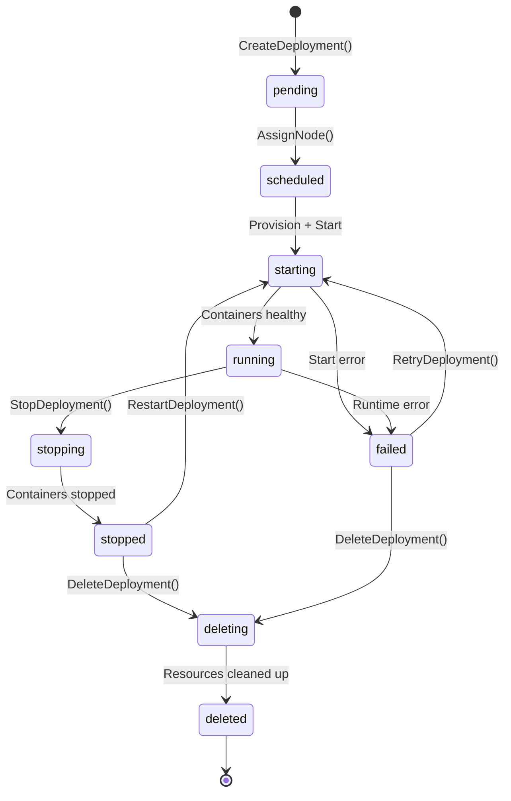

# Deployment State Machine

Source: `internal/core/domain/deployment.go` — `validTransitions` map (line 213)

## Transition Table

| From | To | Trigger |
|------|-----|---------|
| `pending` | `scheduled` | Node assigned by scheduler |
| `scheduled` | `starting` | Provisioner picks up deployment |
| `starting` | `running` | All containers start successfully |
| `starting` | `failed` | Container start error / timeout |
| `running` | `stopping` | User requests stop |
| `running` | `failed` | Runtime crash / health check failure |
| `stopping` | `stopped` | All containers stopped |
| `stopped` | `starting` | User requests restart |
| `stopped` | `deleting` | User requests delete |
| `failed` | `starting` | User retries deployment |
| `failed` | `deleting` | User deletes failed deployment |
| `deleting` | `deleted` | All resources cleaned up |

## Terminal States

- **`deleted`** — no transitions out (terminal)
- **`failed`** — recoverable: can retry (`starting`) or delete (`deleting`)
